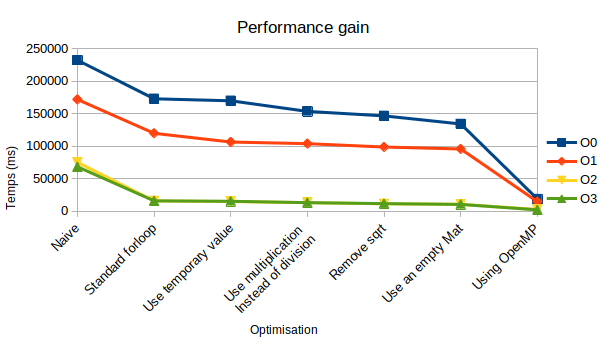
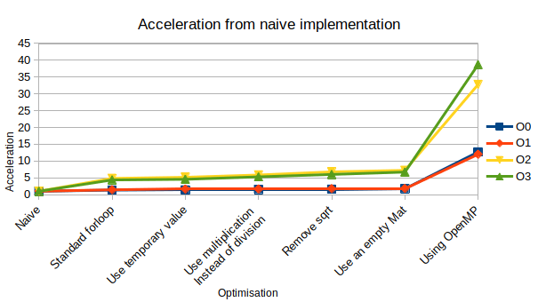
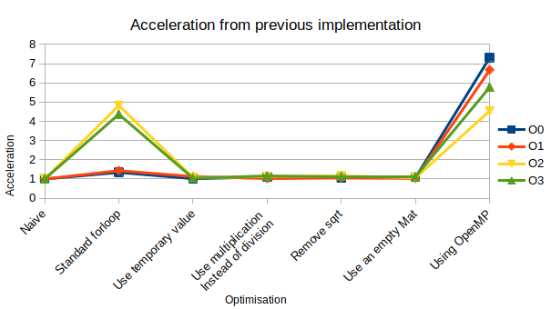

# Méthodologie d’Optimisation pour le Comptage de Personnes</center>


## I. Introduction

Nous avons pour objectif de réaliser, à l’aide d’une caméra, un comptage de personne dans un contexte simple puis de profiler l’application et d’appliquer la méthodologie d’optimisation sur la partie la plus coûteuse.

Ce que nous entendons par contexte simple est :

* Un arrière plan plat, si possible blanc, et éclairé par une lumière homogène et constante. 
* Une ou deux personnes mobile maximum.


## II. Fonctionnement

Le comptage des personnes est réalisé de manière relativement naive. Nous calculons dans un premier temps l'arrière plan, nous créons ensuite avec celui-ci une image binaire contenant les objets en mouvement, et comptons ensuite les composantes connexes de cette image binaire.


Pour calculer l'arrière plan d'une image courante, nous calculons l'écart-type $\sigma(x,y)$ de l'illuminance de chaque pixel sur la suite d'image $I$ correspondant aux $N$ images précédentes grâce à la formule suivante :

$$\sigma(x,y) = \sqrt{\frac{1}{N}\sum_{i=1}(I_i(x,y)-\mu(x,y))^2}$$

<center><i>où</i></center>

$$\mu(x,y) = \frac{1}{N} \sum_{i=1}^N I_i(x,y)$$

Si l'écart type $\sigma(x,y)$ d'un pixel est plus petit qu'un seuil $S$, alors celui-ci fait partie de l'arrière plan.

Une fois l'arrière plan obtenu, nous créons une image binaire où
$$
I(x,y) =
\begin{cases}
  0 \text{ if }\ \sigma(x,y) < S \\
  1 \text{ otherwise}
\end{cases}
$$

Il convient maintenant de filtrer le bruit relatif à divers facteurs telles que l'éclairage et la qualité de la caméra. Nous utilisons pour cela l'opérateur morphologique de fermeture.

La nombre de personnes est maintenant obtenue en comptant les composantes connexes d'une taille supérieure à un seuil $T$.

## III. Performance

Le programme a été implémenté en *C++* avec l'aide la la biblihotèque *OpenCV*.

Pour mesurer le temps d'exécution des différentes étapes, nous avons utilisé la fonction `gettimeofday()`. En effet comme OpenCV est déjà très optimisé, des outils de *profiling* telle que `gprof` envoient des résultats érronés.

Voici les temps d'éxécutions moyens des principales parties du programme:

* Lecture de la caméra: `536 ms`
* Calcul de l'arrière plan: `207667 ms`
* Filtrage de l'image: `575 ms`
* Comptage des composantes connexes: `869 ms`
* Création de l'image de sortie: `381 ms`
* Affichage du résultat: `232 ms`

Nous nous somme donc concentré sur la partie relative au calcul de l'arrière plan de l'image, celle-ci étant la partie la plus coûteuse.


## IV. Optimisation

Le calcul de l'arrière plan est fait à l'aide des trois fonctions `meanIlluminance()`, `standardDeviationIlluminance()` et `computeForeground()`, implémentés de la façon suivante :

```cpp
static double meanIlluminance(const std::list<cv::Mat> &frames, int32_t x, int32_t y) {
    double mean = 0;
    
    std::for_each(
            frames.cbegin(), frames.cend(),
            [&mean, &x, &y](const cv::Mat &frame) { mean += frame.at<uint8_t>(y, x); }
    );
    mean /= MINIMUM_FRAME_COUNT;
    
    return mean;
}


static double standardDeviationIlluminance(const std::list<cv::Mat> &frames, int32_t x, int32_t y) {
    double mean = meanIlluminance(frames, x, y);
    double stdDev = 0;
    double sd;
    
    std::for_each(
            frames.cbegin(), frames.cend(),
            [&mean, &stdDev, &x, &y](const cv::Mat &frame) {
                stdDev += (frame.at<uint8_t>(y, x) - mean) * (frame.at<uint8_t>(y, x) - mean);
            }
    );
    sd = sqrt(stdDev / MINIMUM_FRAME_COUNT);
    
    return sd;
}


static void computeForeground(const std::list<cv::Mat> &frames, cv::Mat &dst, int32_t cols, int32_t rows) {
    frames.back().copyTo(dst);
    
    for (int y = 0; y < rows; y++) {
        for (int x = 0; x < cols; x++) {
            if (standardDeviationIlluminance(frames, x, y) < BACKGROUND_THRESHOLD) {
                dst.at<uint8_t>(y, x) = 0;
            }
            else {
                dst.at<uint8_t>(y, x) = 255;
            }
        }
    }
}
```

### 1. Utilisation de boucle `for` standard

La première amélioration consiste à remplacer les boucle `std::for_each` par des boucles `for` standards, on évite ainsi l'utilisation d'énumérateur et de lambda, le programme transforme une boucle `foreach`, en boucle for lors de la compilation :

```cpp
static double meanIlluminance(const std::list<cv::Mat> &frames, int32_t x, int32_t y) {
    double mean = 0;
    
    for (const cv::Mat &frame : frames) {
        mean += frame.at<uint8_t>(y, x);
    }
    mean /= MINIMUM_FRAME_COUNT;
    
    return mean;
}


static double standardDeviationIlluminance(const std::list<cv::Mat> &frames, int32_t x, int32_t y) {
    double mean = meanIlluminance(frames, x, y);
    double sd = 0;
    
    for (const cv::Mat &frame : frames) {
        sd += (frame.at<uint8_t>(y, x) - mean) * (frame.at<uint8_t>(y, x) - mean);
    }
    sd = sqrt(sd / MINIMUM_FRAME_COUNT);
    
    return sd;
}
```

### 2. Utilisation d'une variable temporaire pour le calcul de $\sigma(x,y)$

Dans un seconds temps, nous avons évité le calcul redondant d'une partie de la formule de $\sigma(x,y)$ en passant par une variable temporaire :

```cpp
static double standardDeviationIlluminance(const std::list<cv::Mat> &frames, int32_t x, int32_t y) {
    double mean = meanIlluminance(frames, x, y);
    double sd = 0, tmp;
    
    for (const cv::Mat &frame : frames) {
        tmp = frame.at<uint8_t>(y, x) - mean;
        sd += tmp * tmp;
    }
    sd = sqrt(sd / MINIMUM_FRAME_COUNT);
    
    return sd;
}
```

### 3. Utilisation de multiplication au lieux de division

Les divisions par des constantes ont été remplacé par des multiplications par l'inverse de celles-ci, une multiplication étant plus courte en terme de cycle qu'une division :

```cpp
static double meanIlluminance(const std::list<cv::Mat> &frames, int32_t x, int32_t y) {
    double mean = 0;
    
    for (const cv::Mat &frame : frames) {
        mean += frame.at<uint8_t>(y, x);
    }
    mean *= INV_MINIMUM_FRAME_COUNT;
    
    return mean;
}


static double standardDeviationIlluminance(const std::list<cv::Mat> &frames, int32_t x, int32_t y) {
    double mean = meanIlluminance(frames, x, y);
    double sd = 0, tmp;
    
    for (const cv::Mat &frame : frames) {
        tmp = frame.at<uint8_t>(y, x) - mean;
        sd += tmp * tmp;
    }
    sd = sqrt(sd * INV_MINIMUM_FRAME_COUNT);
    
    return sd;
}
```

### 4. Suppression de la racine carré

La racine carré a été supprimée en comparant maintenant $\sigma(x,y)$ avec $S^2$ (qui est calculé à la compilation).

```cpp
static double standardDeviationIlluminance(const std::list<cv::Mat> &frames, int32_t x, int32_t y) {
    double mean = meanIlluminance(frames, x, y);
    double sd = 0, tmp;
    
    for (const cv::Mat &frame : frames) {
        tmp = frame.at<uint8_t>(y, x) - mean;
        sd += tmp * tmp;
    }
    
    return sd * INV_MINIMUM_FRAME_COUNT;
}


static void computeForeground(const std::list<cv::Mat> &frames, cv::Mat &dst, int32_t cols, int32_t rows) {
    frames.back().copyTo(dst);
    
    for (int y = 0; y < rows; y++) {
        for (int x = 0; x < cols; x++) {
            if (standardDeviationIlluminance(frames, x, y) < BACKGROUND_THRESHOLD_SQUARED) {
                dst.at<uint8_t>(y, x) = 0;
            }
            else {
                dst.at<uint8_t>(y, x) = 255;
            }
        }
    }
}
```


### 5. Initialisation d'une matrice vide

Nous créions jusque là une nouvelle matrice pour l'image binaire en clonant la dernière image. Cela été remplacé par l'initialisation d'une nouvelle matrice. L'initialisation ne néssite pas un parcours de l'objet, contrairement au clonage d'une matrice.

```cpp
static void computeForeground(const std::list<cv::Mat> &frames, cv::Mat &dst, int32_t cols, int32_t rows) {
    dst = cv::Mat(rows, cols, CV_8UC1);
    
    for (int y = 0; y < rows; y++) {
        for (int x = 0; x < cols; x++) {
            if (standardDeviationIlluminance(frames, x, y) < BACKGROUND_THRESHOLD_SQUARED) {
                dst.at<uint8_t>(y, x) = 0;
            }
            else {
                dst.at<uint8_t>(y, x) = 255;
            }
        }
    }
}
```

### 6. Parallélisation avec *OpenMP*

Enfin, nous parallèlisons le calcul de chaque pixel de l'image binaire grâce à *OpenMP* :

```cpp
static void computeForeground(const std::list<cv::Mat> &frames, cv::Mat &dst, int32_t cols, int32_t rows) {
    dst = cv::Mat(rows, cols, CV_8UC1);
    
    #pragma omp parallel for default(none) shared(dst) firstprivate(rows, cols, frames)
    for (int y = 0; y < rows; y++) {
        for (int x = 0; x < cols; x++) {
            if (standardDeviationIlluminance(frames, x, y) < BACKGROUND_THRESHOLD_SQUARED) {
                dst.at<uint8_t>(y, x) = 0;
            }
            else {
                dst.at<uint8_t>(y, x) = 255;
            }
        }
    }
}
```


## V. Statistiques 

L’ensemble des tests ont été effectué sur un processeur *Intel(R) Core(TM) i7-9750H CPU @ 2.60GHz
6 cores (12 threads)* avec une valeur $N = 5$ (moyenne sur les 5 images précédentes). Les temps obtenue sont une moyenne sur 20 tour de boucle.

Voici ci-dessous le temps de calcul suivant les optimisations manuelles et l’optimisation compilateur choisis, l’accéleration total à chaque étape par rapport à l’algorithme naif, ainsi que l’accéleration entre chaque optimisation :




Sur le graphique on voit qu'à chaque étape d'optimisation, le temps d'exécution diminue. Les plus grands écarts étant entre l'implémentation naive et le passage de `std::for_each` à une boucle `for`, ainsi que la parallèlisation avec *OpenMP* car le calcul de chaque pixel est indépendant.

Pour les autres améliorations, le gain est plus petit mais quand même visible. par exemple entre l'utilisation de valeur temporaire (~170000 ms) et l'utilisation de multiplication (~150000 ms) en `O0`.
Quelques soit les niveaux d'optimisation utilisés (`O0` à `O3`), les courbes ont la même tendance, bien que les gains sur les  courbes `O2` et `O3` soient moindres, le programme optimisant déjà fortement le programme.



Dans ce graphique on voit le facteur d'accélération gagné pour chaque amélioration en fonction de l'implémentation naive, Le programme est ainsi 5 fois plus rapide en `O2` et `O3`, et jusqu'à 40 fois plus rapide en `O3` avec toutes les améliorations implémentés.
La courbe en O3 est légèrement en dessous de celle en O2, cela peut s'expliquer par le fait que le programme cherche tellement à optimiser qu'il prend trop de temps.



Ce dernier graphique met encore plus en évidence les améliorations les plus efficaces, qui sont le passage à une boucle `for`  standard et l'utilisation de *OpenMP*.

## VI. Conclusion

Nous avons réalisé un programme permettant à partir d'une vidéo de compter des personnes et nous avons pu accélérer notre programme grâce à diverses améliorations comme l'utilisation d'opérations moins longues en terme de cycle ou en remplaçant certaines fonctions lentes par d'autre.

Mais de toutes les améliorations l'utilisation du parallélisme par *OpenMP* est la meilleure, son gain est le plus grand (~750% en `O0`) car la principale boucle du calcul de l'arrière plan est facilement parallèlisable.
